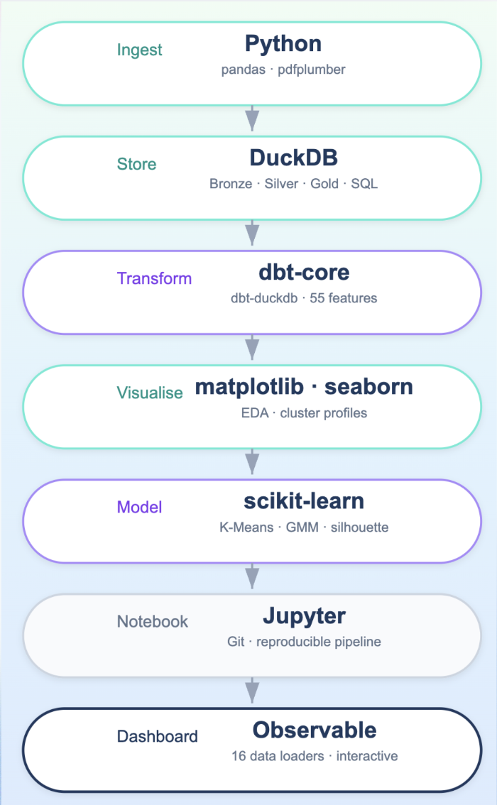

# FinSights: Customer Spending Intelligence System

**DS5500 Capstone Project** | Northeastern University | Spring 2026

**Built by:** Omkar Sonar

**Professor:** Philip Bogden, PhD

**Stakeholder:** Sean Reardon, Data & Analytics Manager, Bangor Savings Bank


---

## Project Overview

Bank transactions record the rhythm of daily life. Though masked and concise, they reveal a customer's habits, routines, and financial behavior.

The initial goal of this project was fraud detection. However, early exploration revealed that the dataset contained no fraud labels, making supervised fraud detection infeasible. This led to a pivot toward **customer segmentation and spending intelligence**, a direction that provides measurable outcomes and concrete business value.

FinSights is a **customer intelligence system** that segments Bangor Savings Bank retail debit card customers by behavioral patterns, enabling the bank to:
 
1. Target the right customers for the **Buoy Local rewards program**
2. Deliver **personalized cashback incentives** aligned with actual spending habits
3. Identify customers who may be **disengaging** before they churn
4. **Promote local businesses** to the most relevant customer segments
 
This is a **proof of concept** built on a 65-day observation window (November 2025 - January 2026).

---

## Data

| Dataset | Records | Description |
|---|---|---|
| Customer Demographics | 276,836 | Profiles including relationship tenure, product holdings, active status |
| Debit Card Transactions | 8,137,375 | Merchant name/category, ATM location, amount, date/time |

Both datasets share a masked `CustomerID` as the linking identifier. The observation window covers approximately 65 days (November 2025 to January 2026).
 
---
 
 ## Methodology
 
### Data Pipeline (Medallion Architecture)
 
| Layer | Schema | Built By | Description |
|---|---|---|---|
| Bronze | `bronze.*` | `src/load_db.py` | Raw data loaded as-is (all VARCHAR) |
| Silver | `silver.*` | `src/load_db.py` | Cleaned, typed, deduplicated |
| Gold | `gold.*` | `dbt run` + notebook | Feature-engineered, analysis-ready |

<p align="center">
  
</p>

### Segmentation
 
- **55 behavioral features** engineered per customer (spending totals, category shares, temporal patterns, geographic behavior, product holdings)
- **K-Means clustering (k=4)** selected through multi-method validation:
  - HDBSCAN sweep confirmed no naturally discrete groups exist (95%+ in one mega-cluster)
  - GMM soft assignments validated hard boundaries (98.8% of customers assigned with >90% confidence)
  - Distinctiveness count justified k=4: the only value where every cluster has ≥9 features with >0.3 SD from the population mean
- **Four segments identified:**
  - **Active Everyday Spenders** (51.5%) - BSB's core: 91 txns, 42 merchants, $4,249 avg spend
  - **Lending-Engaged Loyal Customers** (17.0%) - deepest relationships: 17.5yr tenure, 99% have loans
  - **Low-Frequency Big Spenders** (17.0%) - bill payers: 11 txns, $161 avg transaction size
  - **Low-Activity Digital Users** (14.4%) - churn risk: 6 txns, $126 total, mostly subscriptions
 
### Interactive Dashboard
 
An Observable Framework dashboard provides segment exploration and business recommendations across four pages: Overview, Trends, Customer Profiles, and Recommendations.

**Live Dashboard:** [https://nucapstone.github.io/project-spring26-OmkarSonar24/](https://nucapstone.github.io/project-spring26-OmkarSonar24/)

---

## Project Structure
 
```
project-spring26-OmkarSonar24/
│
├── src/                              # Pipeline scripts (run in order)
│   ├── config.py                     #   All file paths and constants
│   ├── ingest_transactions.py        #   Step 1: Raw CSV → transactions_clean.csv
│   ├── ingest_customers.py           #   Step 2: Raw Excel → customers_clean.csv
│   ├── mcc_labeler.py                #   Step 3: Visa PDF → mcc_mapping_labeled.csv
│   └── load_db.py                    #   Step 4: CSVs → DuckDB bronze + silver layers
│
├── capstone_dbt/                     # dbt project (gold layer)
│   ├── models/
│   │   ├── marts/
│   │   │   ├── mrt_mcc_categories.sql
│   │   │   └── mrt_customer_features.sql
│   │   └── sources.yml
│   ├── seeds/
│   │   └── mcc_category_rules.csv
│   ├── macros/
│   │   └── generate_schema_name.sql
│   ├── profiles_template.yml
│   └── dbt_project.yml
│
├── finsights-dashboard/              # Observable Framework dashboard
│   ├── src/
│   │   ├── index.md                  #   Overview page
│   │   ├── eda.md                    #   Trends
│   │   ├── segments.md               #   Customer Profiles (interactive)
│   │   ├── insights.md               #   Recommendations
│   │   └── data/                     #   Python data loaders
│   │       ├── customer_clusters.csv.py
│   │       ├── demographics.csv.py
│   │       ├── segment_profiles.csv.py
│   │       ├── segment_geo.csv.py
│   │       ├── segment_categories.csv.py
│   │       ├── segment_maine_merchants.csv.py
│   │       ├── segment_maine_cities.csv.py
│   │       ├── segment_oos_merchants.csv.py
│   │       ├── segment_oos_cities.csv.py
│   │       ├── segment_recurring.csv.py
│   │       ├── hourly_pattern.csv.py
│   │       ├── daily_pattern.csv.py
│   │       ├── monthly_trend.csv.py
│   │       ├── category_spend.csv.py
│   │       ├── top_merchants.csv.py
│   │       └── geo_spending.csv.py
│   ├── observablehq.config.js
│   └── package.json
│
├── notebooks/                        # Analysis notebooks (run in order)
│   ├── 01_customers_eda.ipynb
│   ├── 02_transactions_eda.ipynb
│   ├── 03_stakeholder_analysis.ipynb
│   └── 04_clustering.ipynb
│
├── data/                             # Data directory (gitignored except sample/)
│   ├── raw/                          #   Original CSV + XLSX from BSB (not tracked)
│   ├── processed/                    #   Generated clean CSVs (not tracked)
│   └── sample/                       #   Anonymized 500-customer sample (tracked)
│       ├── customers_sample.csv
│       ├── transactions_sample.csv
│       └── mcc_mapping_labeled.csv
│
├── docs/                             # Deployed dashboard (GitHub Pages)
|
|
├── figs/                             # Visualizations
│   ├── eda/
│   └── clustering/
│
├── misc/                             # Reference materials
│   └── visa-merchant-data-standards-manual.pdf
│
├── presentations/                    # Slide decks
│   ├── class/
│   └── stakeholder/
│
├── pyproject.toml                    # Python dependencies (uv)
├── uv.lock                           # Locked dependency versions
└── README.md
```

---

## Setup and Reproduction

### Prerequisites

- Python 3.12+
- [uv](https://docs.astral.sh/uv/) package manager
- Node.js 18+ (for the Observable dashboard)

### Step 1: Clone and install dependencies

**Using uv (recommended):**

```bash
git clone <repo-url>
cd project-spring26-OmkarSonar24
uv sync
source .venv/bin/activate
```

### Step 2: Choose your data source
 
**Option A — Sample data (no BSB files needed):**
 
A pre-built sample dataset (500 customers, ~28K transactions) is included in `data/sample/`. The pipeline automatically detects the absence of full data files and falls back to sample data. Skip to Step 4.
 
**Option B — Full BSB data:**
 
Place the raw files from Bangor Savings Bank into `data/raw/`:
 
```
data/raw/
├── OmkarCapstone_Final_ArchivePassportData_20260123.csv
└── OmkarCustomerDemographics.xlsx
```
 
### Step 3: Run the ingestion pipeline (Option B only)
 
```bash
python src/ingest_transactions.py
python src/ingest_customers.py
python src/mcc_labeler.py
```
 
### Step 4: Build the database
 
```bash
python src/load_db.py
```
 
This creates `data/capstone.duckdb` with bronze and silver schemas.
 
### Step 5: Run dbt (gold layer)
 
```bash
mkdir -p ~/.dbt
cp capstone_dbt/profiles_template.yml ~/.dbt/profiles.yml
```
 
Edit `~/.dbt/profiles.yml` and replace the placeholder path with your actual DuckDB path:
 
```bash
echo $(pwd)/data/capstone.duckdb
```
 
Then build the gold layer:
 
```bash
cd capstone_dbt
dbt debug    # verify connection
dbt seed     # load MCC category rules
dbt run      # build mrt_mcc_categories + mrt_customer_features
cd ..
```
 
### Step 6: Run notebooks
 
```bash
python -m ipykernel install --user --name=capstone --display-name "Python (capstone)"
jupyter notebook
```
 
Run notebooks 01 through 04 in order, selecting the **Python (capstone)** kernel. Notebook 04 (clustering) saves cluster assignments to `gold.mrt_customer_clusters` in DuckDB.
 
### Step 7: Launch the dashboard
 
```bash
cd finsights-dashboard
npm install
npm run dev
```
 
The dashboard runs at `http://localhost:3000` and connects to `../data/capstone.duckdb` via Python data loaders.

---

## Key Technical Decisions

| Decision | Rationale |
|---|---|
| Custom CSV parser | Raw transaction file has embedded commas in ATM addresses. Standard parsers fail. MCC code used as positional anchor. |
| Pivot from fraud to segmentation | No fraud labels in dataset. Proactively surfaced to stakeholder as analytical integrity. |
| K-Means k=4 | Distinctiveness count shows k=4 is the only value where every cluster has ≥9 features at >0.3 SD from population mean. |
| Full 55-feature set | Three-way comparison (55 vs 41 vs 33 features) showed full set outperforms pruned versions at all business-relevant k values. |
| Observable Framework | Reactive dashboard with Python data loaders connecting directly to DuckDB - no intermediate API layer needed. |

---

## Known Limitations

- **Short observation window** - 65 days (Nov–Jan) includes holiday seasonality and post-holiday pullback. Patterns may not generalize to a full year.
- **Customer coverage** - analysis covers 58,677 customers with both transaction and demographic records. ~59,000 additional transacting customers lacked demographic data and were excluded.
- **MCC categorization** - some codes are ambiguous (e.g., Bookstores spans Amazon to physical retailers). Requires ongoing stakeholder validation.
- **Soft cluster boundaries** - customer behavior exists on a continuum. HDBSCAN confirmed no naturally discrete groups; segments are useful business groupings, not hard categories.

## Future Work

- **Predictive modeling** - classify customers as UPGRADE / STABLE / DOWNGRADE using temporal train/test splits to identify at-risk customers before they churn.
- **Extended observation window** - a 12-month dataset removes seasonal bias and reveals true behavioral trends.
- **Cross-sell scoring** - 30,000+ Active Everyday Spenders have zero loans. Predictive models could identify which customers are most likely to adopt lending products.